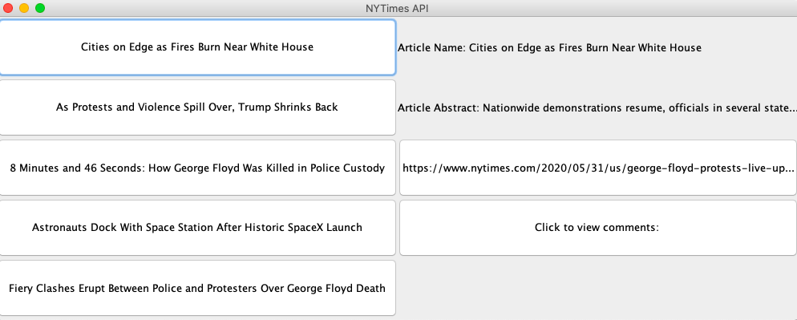

<ins>**New York Times API**</ins>

This project uses two [New York Times APIs](https://developer.nytimes.com/apis) to return the top five most viewed articles
and their comments. 

**Technologies**
 
* APIs
* JSON
* Retrofit
* Gson
* Gradle
* Mockito
* MVC
* Factory Pattern
* Executable Jar Files
* Markdown

